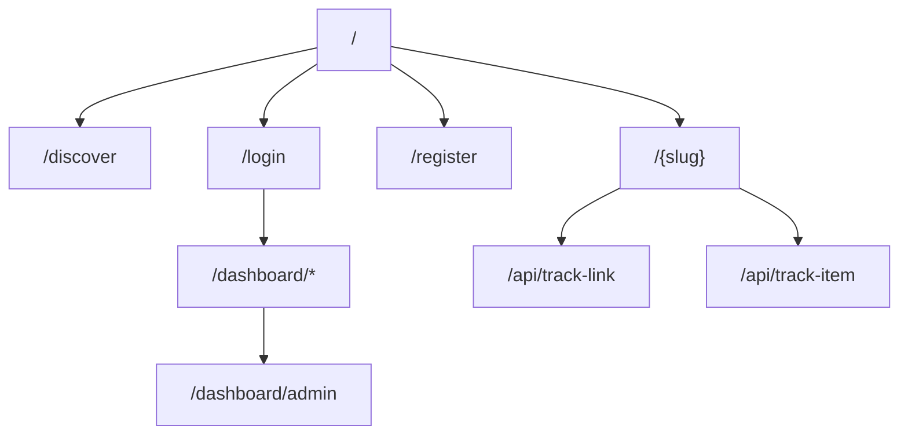
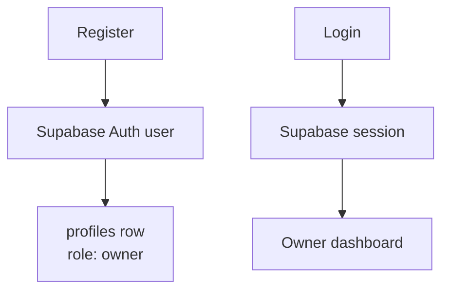
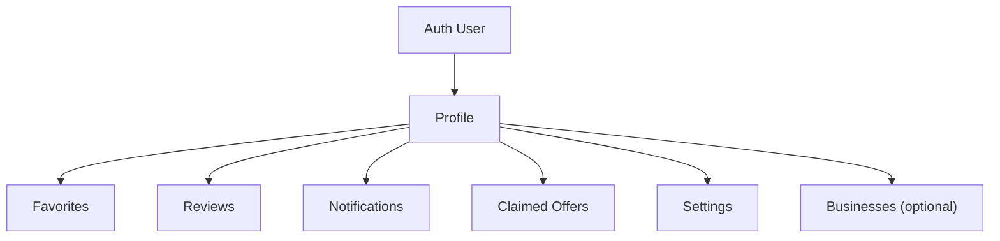
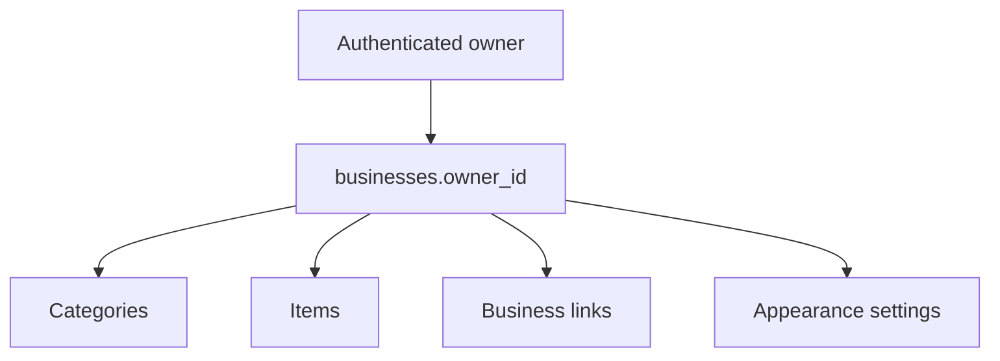
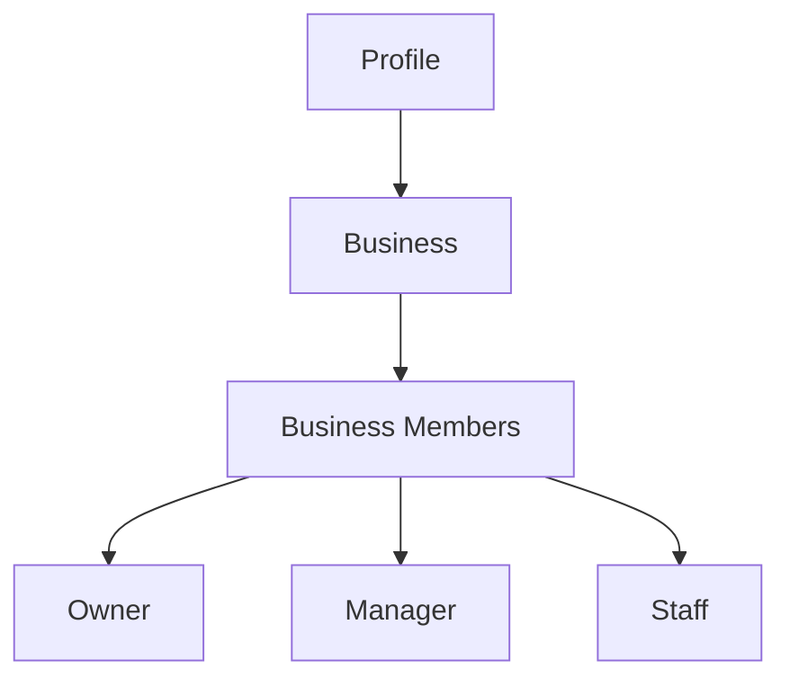
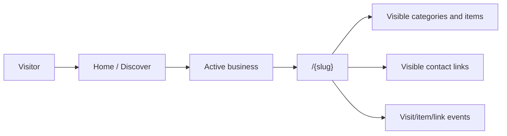
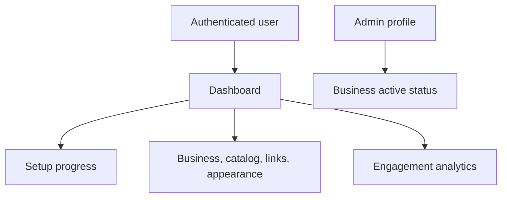

# Architecture

## Architectural direction

Listahan is evolving from a business-focused directory into a profile-first, municipality-aware digital ecosystem for Oriental Mindoro and Occidental Mindoro. This document deliberately distinguishes the MVP that exists today from the target platform architecture. Future sections are direction, not implemented behavior.

## Application and routing

### Current Implementation

The application uses Next.js 16 App Router, React 19, TypeScript, Tailwind CSS 4, and Supabase. Filesystem routes live in `app/`; most route pages are Server Components and fetch directly through Supabase clients.



The dashboard has routes for business, categories, items, links, appearance, analytics, and admin. `/account` is the authenticated profile-first destination for users without a business, and `/account/settings` is its current non-editing settings route. `/dashboard` preserves the owner dashboard and redirects authenticated users without a business to `/account`.

### Target Architecture

Routes remain App Router routes, but route areas will represent both public discovery and authenticated profile experiences. A future account area can support personal settings, favorites, reviews, notifications, claims, and optional business management without treating business ownership as the prerequisite for participation.

### Migration Strategy

Keep existing public and dashboard routes stable. Introduce new account/profile routes incrementally, then connect each one to a versioned data migration and RLS policy. Complete or intentionally remove incomplete navigation only through an explicitly scoped product change.

## Authentication and identity

### Current Implementation

Registration creates a Supabase Auth user with the submitted full name in Auth metadata, then sends the new user to `/account` rather than assuming dashboard ownership. The codebase includes a Phase 1 profile-foundation migration that, once applied, provisions a corresponding `profiles` record through an Auth database trigger and backfills Auth users missing a Profile. Login continues to enter through `/dashboard`; that route preserves owner behavior and redirects users without a business to `/account`. The legacy `owner` role remains unchanged in this phase because existing dashboard workflows are business-focused. Email/password login creates a browser session; middleware refreshes it.



### Target Architecture

Authentication becomes profile-centric. Every authenticated person receives a Profile. A person can use Listahan without creating or managing a business.



### Migration Strategy

Preserve the existing Auth-to-profile relationship. Change default/profile semantics through a planned migration and onboarding update rather than reinterpreting existing `owner` records. Add consumer features one at a time with profile-based RLS; do not require business creation to enable them.

## Business ownership and workspace access

### Current Implementation

`businesses.owner_id` is queried against the authenticated user's ID. Dashboard pages select the owner's most recently created business. Owners manage categories, items, links, and appearance through that business. An admin server action validates `profiles.role === "admin"` before changing a business's active state.



### Target Architecture

Business ownership is optional and businesses will support membership rather than a single implicit owner relationship. Planned member roles are Owner, Manager, and Staff. Multi-owner or multi-member businesses are not implemented today.



### Migration Strategy

Retain `businesses.owner_id` during transition as the legacy primary-owner reference. Introduce a `business_members` model, backfill the owner as an Owner member, migrate authorization checks to membership, and only consider relaxing the legacy field after all ownership flows are migrated.

## Public storefront and discovery

### Current Implementation

The home page and `/discover` list active businesses. `/discover` searches name, description, industry, and city. `/{slug}` reads an active business, categories, visible items, visible links, and appearance settings. It records a visit, renders a hero, and gives the client-side storefront in-memory item filtering, category navigation, item detail modal, item-click logging, and external contact links.



### Target Architecture

Public storefronts remain the business-presence foundation. Discovery will become municipality-first and can later surface consumer engagement (favorites, reviews, offers, follows) when those capabilities are implemented and appropriately moderated.

### Migration Strategy

Preserve the `/{slug}` route and active/visible safeguards. Add geographic data and engagement features behind explicit schema, policy, and UI changes; do not change the public storefront contract merely to prepare for a future feature.

## Dashboard and administration

### Current Implementation

The dashboard uses `app/dashboard/layout.tsx` with a desktop sidebar and client-side mobile drawer. Overview presents setup progress. Management screens use browser Supabase clients for interactive CRUD; analytics aggregates business visits, link clicks, and item clicks. The service-role client is used server-side for analytics inserts and the admin-validated business-status update. Owner navigation retains business management and adds Profile/Settings links; non-owner account navigation shows Profile, Settings, and Register Business only.



### Target Architecture

The dashboard becomes a role-aware workspace for a selected business, while a separate account area serves all profiles. Administrative tools should support platform trust and community health, not become the center of the product experience.

### Migration Strategy

Introduce selected-business and membership context only when the membership model exists. Keep service-role operations narrow, server-only, and authorization-checked. Add new administrative capabilities only where there is a user/community outcome and a documented policy.

## Supabase and data access

### Current Implementation

`lib/supabase/server.ts` creates a cookie-aware server client; `client.ts` creates a browser client; `middleware.ts` refreshes sessions. `admin.ts` holds a service-role client for server-only use. `lib/upload.ts` validates JPEG/PNG/WebP images up to 5 MB, uploads to a caller-specified Storage bucket, and returns a public URL.

The repository has an empty `schema.sql` and a tracked Phase 1 profile-foundation migration. Live Supabase remains the schema authority until that migration is applied. Application code assumes RLS protects normal owner writes, but policies are not yet versioned here.

### Target Architecture

Supabase remains the managed Auth/Postgres/Storage platform, with versioned migrations, generated types, documented Storage policies, and auditable RLS. The profile is the authorization root for consumer actions and business memberships govern business workspaces.

### Migration Strategy

Export and commit the current schema, policies, indexes, functions, and triggers before material data-model work. Add migrations and generated types to each data-changing pull request. Preserve service-role access only for narrowly defined server-side jobs/actions.

## Components and rendering

### Current Implementation

Shared UI lives in `components/`; route-local interactive components live beside routes. Server Components perform initial reads, redirects, metadata generation, and server actions. Client Components are used for state, event handlers, browser APIs, navigation hooks, charts, forms, search, and the public storefront.

Some files under `components/ui/` contain copied `Card` implementations despite their filenames, and `components/ui/avatar.tsx` contains copied navigation code. This is current code, not a recommended component contract.

### Target Architecture

Maintain server-first rendering and reusable, single-purpose components. Shared primitives should have accurate names and stable APIs; feature components should remain local until they have a genuine cross-feature use.

### Migration Strategy

Do not refactor components as part of documentation or data work. Consolidate duplicated primitives only in a separately scoped, tested refactor that preserves UI and behavior.

## Municipality-first architecture

Listahan is geographically focused. The target model places businesses in municipalities and municipalities in provinces. The initial geographic scope is **Oriental Mindoro** and **Occidental Mindoro**. Expansion beyond Mindoro should be configuration-driven—through geographic data and settings—not require an architectural redesign.

The current business model stores free-form `city` and `province` values. Municipality records and enforced relationships are future architecture, not current implementation.

## Product Philosophy

Listahan is not merely a business directory. It is intended to become the digital ecosystem for Oriental Mindoro and Occidental Mindoro. New work should strengthen the relationship between residents, visitors, businesses, organizations, government, and the wider community. Consumer experience is as important as business and administrative experience; avoid features that benefit only administrators without a clear community outcome.

## Future Architecture

### Current

Listahan currently has Supabase Auth users, a manually created `profiles` row at registration, and business ownership represented by `businesses.owner_id`. The dashboard is business-workspace oriented, with current access decisions split across page checks, client data access, RLS assumptions, and an admin action. Geographic data is stored as free-form `city` and `province` values.

### Target

The platform will be profile-first: every authenticated person has one Profile, and business ownership is optional. A centralized permission system in `lib/permissions/` will evaluate Profile identity, relevant business context, role, and later feature entitlement. A feature system will model capabilities such as profiles, favorites, reviews, offers, analytics, events, stories, notifications, bookings, and AI separately from plans and roles. Municipality-first geography will place businesses in structured municipalities belonging to provinces, beginning with Oriental Mindoro and Occidental Mindoro.

The one-account philosophy applies to consumers, business owners, future organizations, and future government participants. These are roles and contexts around the same platform identity, not separate account systems.

## Non Goals

Listahan is not intended to become a POS, ERP, accounting product, inventory system, food-delivery platform, or general social network. Its focus remains local discovery, business presence, and community engagement.

## Folder structure

```text
app/              App Router routes, layouts, and API route handlers
components/       Shared public, dashboard, feature, and UI components
lib/              Supabase clients, analytics, upload, and shared utilities
src/lib/          Additional shared helper (`generateSlug`)
public/           Static assets
supabase/.temp/   Supabase CLI link metadata; not migrations
docs/             Product and engineering documentation
middleware.ts     Supabase session refresh
```
