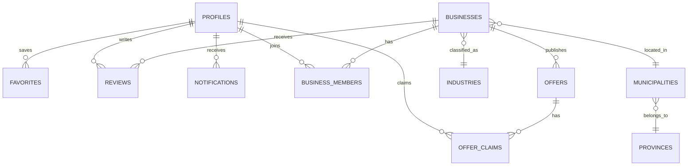

# Database

## Source of truth and confidence

The application uses Supabase Postgres. `schema.sql` remains empty, but the repository now tracks the Phase 1 profile-foundation migration; the wider live schema, historical migrations, and policies are still not versioned here. This document records tables and fields observed in application queries/mutations. It does not claim unobserved types, defaults, constraints, RLS policies, triggers, or indexes as fact.

The live Supabase project remains the operational schema authority until migrations are committed.

## Existing tables observed in code

| Table | Purpose | Fields observed in application code |
| --- | --- | --- |
| `profiles` | Extends Supabase Auth users with app identity and role. Phase 1 provisions one row for each Auth user through an Auth trigger; Phase 3 adds Profile experience fields. | `id`, `email`, `full_name`, `role`, `avatar_url`, `city`, `province`, `bio` |
| `favorites` | A Profile's saved businesses. Introduced by Version 1.5B Phase 1. | `id`, `profile_id`, `business_id`, `created_at` |
| `businesses` | Owner-created public business/storefront profile. | `id`, `owner_id`, `slug`, `name`, `description`, `industry`, `city`, `province`, `logo_url`, `cover_url`, `opening_hours`, `is_active`, `created_at`, `plan` |
| `categories` | Groups a business's items. | `id`, `business_id`, `name`, `sort_order`, `is_visible` |
| `items` | Products or services shown on a storefront. | `id`, `business_id`, `category_id`, `name`, `description`, `price`, `image_url`, `sort_order`, `is_visible` |
| `business_links` | Contact, social, phone, website, and booking links. | `id`, `business_id`, `type`, `label`, `url`, `icon`, `sort_order`, `is_visible`, `is_primary` |
| `appearance_settings` | Per-business storefront styling preferences. | `id`, `business_id`, `theme`, `accent_color`, `surface_style`, `card_radius`, `button_style`, `font_style` |
| `business_analytics` | Storefront visit events. | `business_id`; `created_at` is queried |
| `link_clicks` | Link interaction events. | `business_id`, `link_id`; `created_at` is queried |
| `item_clicks` | Item interaction events. | `business_id`, `item_id`; `created_at` is queried |

Supabase's managed `auth.users` table is also used indirectly: its ID is inserted into `profiles.id` during registration.

## Relationships inferred from application usage

```text
auth.users  1 ── 1 profiles
profiles    1 ── * businesses              (businesses.owner_id)
businesses  1 ── * categories              (categories.business_id)
businesses  1 ── * items                   (items.business_id)
categories  1 ── * items (optional)        (items.category_id)
businesses  1 ── * business_links          (business_links.business_id)
businesses  1 ── 0..1 appearance_settings  (appearance_settings.business_id)
businesses  1 ── * business_analytics      (business_analytics.business_id)
businesses  1 ── * link_clicks             (link_clicks.business_id)
business_links 1 ── * link_clicks          (link_clicks.link_id)
businesses  1 ── * item_clicks             (item_clicks.business_id)
items       1 ── * item_clicks             (item_clicks.item_id)
```

The Version 1.5B favorites migration establishes physical foreign keys from `favorites.profile_id` to `profiles.id` and from `favorites.business_id` to `businesses.id`. Both use `ON DELETE CASCADE`; the table permits one row per `(profile_id, business_id)` pair. Other relationships remain logical inferences from field names and queries.

## RLS

Normal clients assume RLS protects owner-managed data. Public pages read active businesses, visible items, and visible links with an anonymous/session client. Dashboard managers make client-side writes to owned records. The service-role client is limited to server-side analytics inserts and an admin-validated status update.

The Version 1.5B favorites migration enables RLS on `favorites`. An authenticated Profile may select, insert, and delete only rows whose `profile_id` equals `auth.uid()`. There is deliberately no update policy: a favorite is either present or removed.

Actual RLS enablement and policies are not present in the repository and must be checked in Supabase before changing data access. A UI filter such as `is_active` or `is_visible` is not itself a complete security policy.

## Triggers

The Phase 1 migration `20260715000000_profile_foundation.sql` tracks `public.handle_new_user()` and the `on_auth_user_created` trigger on `auth.users`. When applied, it creates a Profile after an Auth user is inserted and uses `on conflict (id) do nothing` so retries do not duplicate Profiles. The migration also backfills only Auth users without an existing Profile, preserving existing profile data and roles.

The Phase 3 migration `20260716000000_profile_experience.sql` adds nullable `avatar_url`, `city`, `province`, and `bio` fields without changing existing Profiles or business ownership. It also adds self-only Profile select/update policies. Profile avatar upload is deferred because no dedicated Storage bucket or object policy is configured in the repository.

No other trigger definitions are tracked; inventory any additional live triggers before changing data access.

## Indexes

The Version 1.5B favorites migration creates `favorites_profile_id_created_at_idx` for a Profile's newest-first saved list and `favorites_business_id_idx` for business-side lookup. No other index definitions are tracked. Current queries make these likely indexing candidates, but this is not evidence they exist:

- `businesses.slug`, `businesses.owner_id`, `businesses.is_active`, `businesses.created_at`
- `categories.business_id` and `(business_id, sort_order)`
- `items.business_id`, `items.category_id`, `(business_id, is_visible, sort_order)`
- `business_links.business_id`, `(business_id, is_visible, sort_order)`
- Event-table foreign keys with `created_at` for analytics ranges

## Recommended future tables

These tables are not implemented and require migrations, ownership rules, moderation, and RLS before work begins.

| Table | Purpose |
| --- | --- |
| `profiles` | Already exists. It may later receive account preferences or verification attributes; do not create a duplicate profile table. |
| `favorites` | Implemented for a Profile to save businesses. Saving items is not implemented. |
| `reviews` | Moderated consumer feedback for a business, with author identity, publication state, and abuse controls. |
| `offers` | Time-bounded promotions published by a business. |
| `offer_claims` | Consumer claim/redemption records for offers, with fraud and redemption rules. |
| `notifications` | In-app notices for owners/consumers, with recipient, delivery/read state, and event source. |

## Future improvements

- Export live schema, policies, triggers, functions, and indexes into reviewed Supabase migrations.
- Generate and commit TypeScript database types.
- Document Storage buckets and policies; code uploads public image URLs but does not name a bucket centrally.
- Confirm inferred foreign keys and database-level integrity rules.

## Future Data Model

This section describes target architecture only. None of the tables or relationships below should be treated as current schema, and no migration is created by this documentation update.



### Profiles

`profiles` already exists and is currently created after registration. Target architecture makes it the durable identity layer for every authenticated user, whether or not that person owns a business.

### Favorites

`favorites` is implemented for Profiles to save businesses. The versioned migration creates profile/business foreign keys, cascading deletion behavior, a one-favorite-per-Profile/business constraint, self-only RLS policies, and read-list indexes. Favorites do not include items, collections, analytics, or notifications.

### Reviews

`reviews` is planned for profile-authored feedback on businesses. It requires publication/moderation state, author permissions, and abuse-management policies before implementation.

### Offer Claims

`offer_claims` is planned as the consumer record of an offer claim or redemption. It must be paired with offers, eligibility rules, secure redemption semantics, and fraud controls.

### Notifications

`notifications` is planned for profile-targeted in-app notices. The design must define event sources, delivery/read state, retention, and user preferences.

### Business Members

`business_members` is planned to connect profiles with businesses and a role such as Owner, Manager, or Staff. It enables multi-owner/multi-member businesses; no such model exists today.

### Municipalities

`municipalities` is planned as the structured geographic record for businesses. Municipalities belong to provinces, initially Oriental Mindoro and Occidental Mindoro. Current `city` and `province` fields are free-form values.

### Industries

`industries` is planned as a controlled classification list for businesses. Current `businesses.industry` usage does not establish that a normalized industry table exists.

### Settings and permissions

Account settings are planned as profile-owned data, separate from business appearance settings that already exist. The future permission model should centralize authorization in application helpers and align it with RLS: a Profile is the authorization subject; business context and future memberships add scope; plans may add entitlements but do not replace permission checks. No settings table, permission table, or policy changes are created by this documentation.
