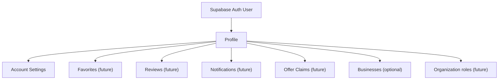
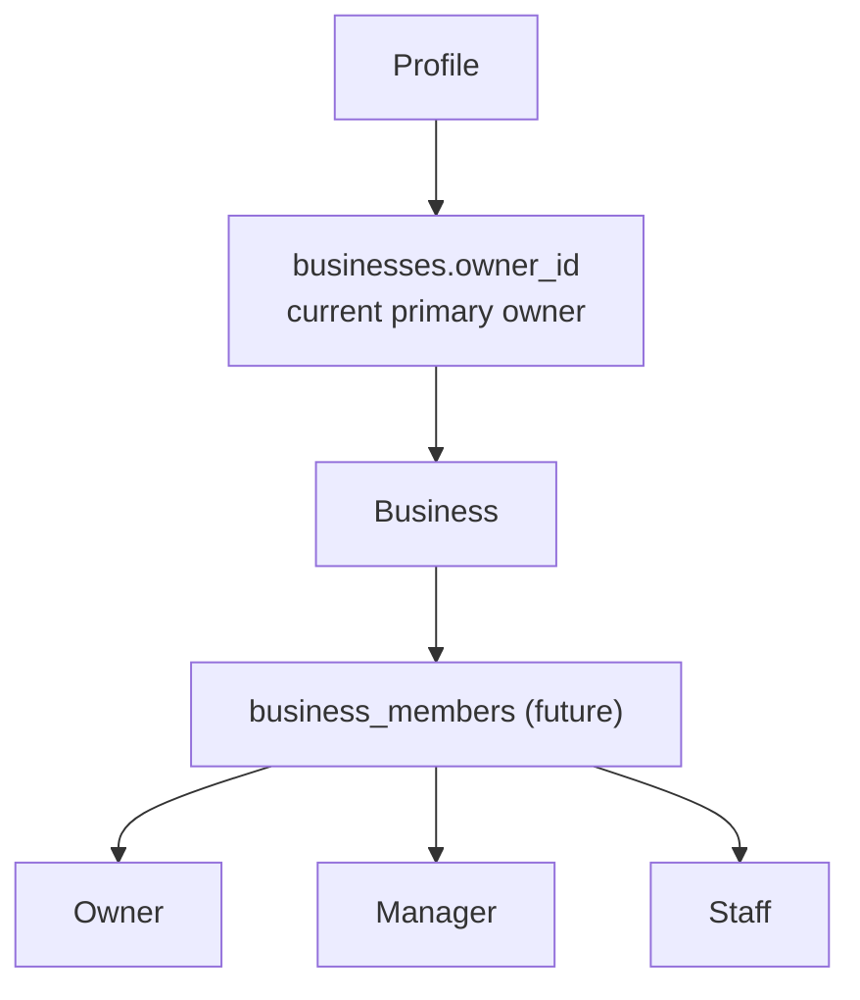
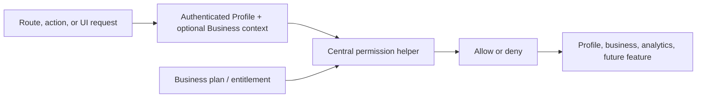

# Version 1.5A — Profile Foundation

**Status:** Current Sprint

## Executive Summary

Listahan began as a business-owner-first local directory: registration assigns an owner role, the dashboard assumes an owner manages a business, and the public product centers on business storefronts. That model delivered Version 1, but it prevents the platform from serving residents and visitors who want to participate without becoming business owners.

Version 1.5A establishes a profile-first foundation. An authenticated person has a Profile first; business ownership becomes an optional capability. This is the smallest architectural shift that makes future community capabilities—favorites, reviews, offers and claims, notifications, organization participation, and municipality-aware discovery—possible without creating disconnected account systems.

This is an implementation contract, not an implementation. It defines the approved scope for the sprint and explicitly excludes later Version 1.5 milestones.

### Phase 1 implementation record

Phase 1 implements only the database and identity foundation: a versioned Auth-user-to-Profile trigger, an idempotent backfill for missing Profiles, and registration metadata needed by the trigger. It deliberately preserves the existing legacy `owner` role and `businesses.owner_id` workflow. Profile/settings screens, permission helpers, role-semantic changes, and every community feature remain follow-up work.

### Phase 1 follow-up work

- Apply `20260715000000_profile_foundation.sql` to a non-production Supabase project, then production, using the database credential required by the Supabase CLI.
- Inspect and version the live Profile RLS policies before adding Profile read/update UI or permission helpers.
- Generate database types after the migration baseline is established.
- Begin Phase 2 only after reviewing applied migration results and owner/admin regression checks; it must not introduce profiles pages, settings UI, favorites, reviews, offers, notifications, or the permission layer without an approved scope update.

## Goals

- Establish profile-first architecture as the identity model for every authenticated user.
- Implement the one-account philosophy: a person joins Listahan once and can later participate as a consumer, business owner, organization member, or other approved role.
- Make business ownership optional without breaking existing owner workflows.
- Provide an authenticated profile experience and account-level user settings.
- Establish a centralized permission layer for profile, business, administrative, and future feature decisions.
- Preserve the existing public directory, storefronts, owner dashboard behavior, and admin business-status workflow.
- Document the foundations required by future favorites, reviews, offers, notifications, and organizations without implementing those features.

## Business Value

Profile-first identity expands Listahan beyond people who already operate a business. Residents and visitors can create an account for their own local-discovery journey before they have any reason to register a business. This reduces the conceptual barrier to participation and provides a durable identity for later community features.

For businesses, onboarding becomes clearer: creating an account and registering a business are separate actions. Existing owners keep their dashboard access, while future owners can start as ordinary participants and add a business when ready. The resulting model also avoids rebuilding identity and authorization for every later feature.

## User Stories

### Visitor creates an account without owning a business

**As a visitor,** I want to create a Listahan account without being asked to operate a business, **so that** I can participate in future community features on my own terms.

**Acceptance criteria**

- Registration creates an authenticated account and a usable Profile.
- The default onboarding does not require business details or business creation.
- The person can reach their profile/settings experience after authentication.
- The person is not redirected into an owner-only dashboard flow merely because they registered.

### Authenticated user automatically receives a profile

**As an authenticated user,** I want my platform profile to exist reliably, **so that** account-level features have one identity record.

**Acceptance criteria**

- Every new Auth user has exactly one corresponding Profile.
- Profile provisioning is safe to retry and does not create duplicates.
- Existing Auth users without a Profile are identified and handled through a reviewed migration/backfill process.
- The application handles a temporarily unavailable Profile safely rather than silently granting broader access.

### User edits their profile

**As an authenticated user,** I want to edit the profile fields approved for this sprint, **so that** my account information remains current.

**Acceptance criteria**

- A user can read and update only their own approved Profile fields.
- Form validation, loading, success, and error states are present.
- The UI does not expose future public-profile, reviewer-verification, organization, or social features as if implemented.
- Changes respect the existing visual system and responsive behavior.

### User registers a first business

**As an authenticated user,** I want to register my first business after account creation, **so that** business ownership is an opt-in workspace capability.

**Acceptance criteria**

- Business registration remains available to an authenticated profile.
- Creating a business preserves the existing `businesses.owner_id` relationship for this release.
- The new owner can access and manage that business through the existing dashboard capabilities.
- A user without a business retains profile access without dashboard errors.

### Existing owner continues using the dashboard

**As an existing owner,** I want my existing business workspace to keep working, **so that** the identity transition does not interrupt my operations.

**Acceptance criteria**

- Existing owner Profiles continue to resolve to their current businesses.
- Existing business, category, item, link, appearance, analytics, and logout flows remain available.
- Public business discovery and `/{slug}` storefront behavior do not regress.
- No existing business is reassigned, hidden, or changed by profile-first onboarding.

### Admin experience remains unchanged

**As an administrator,** I want existing activity controls to remain protected, **so that** profile-first changes do not weaken platform trust controls.

**Acceptance criteria**

- The current admin business-status action still requires an authenticated Profile with role `admin`.
- A standard profile cannot gain administrative access through account or business flows.
- Service-role operations remain server-only and authorization-checked.

### Future organizations reuse the architecture

**As a future organization participant,** I want the platform to use the same core identity model, **so that** organization capabilities do not create a parallel account system.

**Acceptance criteria**

- The documented Profile model can accommodate future organization/government associations.
- No organization account type, organization management UI, or organization database model is implemented in this sprint.
- Permission helpers are designed to accept future role/context inputs without inventing future permissions now.

## Current Architecture

### Authentication

`/register` uses Supabase Auth email/password sign-up, then inserts a `profiles` row with the user's ID, email, full name, and `role: "owner"`. `/login` signs in with email/password and routes to `/dashboard`. Middleware refreshes sessions; dashboard pages call `supabase.auth.getUser()` server-side and redirect unauthenticated requests to `/login`.

The Profile table already exists, but current registration semantics make owner identity the default. The code does not currently provide a profile page or account settings route.

### Business ownership

Business access currently relies on `businesses.owner_id` matching the Auth user ID. Dashboard pages query the most recently created business for that owner. There is no business-members model, business selection context, or delegated owner/manager/staff access.

### Dashboard assumptions

The dashboard layout and navigation are business-workspace oriented. It exposes business, categories, items, links, appearance, analytics, and a Settings navigation item with no matching route. A user without a business is guided to create one, but the dashboard remains the primary post-login destination.

### Current limitations

- A new account is implicitly treated as an owner account.
- Non-owners do not have a purposeful authenticated destination.
- Authorization is distributed among page checks, client data access, RLS assumptions, and a single admin action.
- Database migrations, RLS policies, triggers, indexes, and generated types are not yet versioned in the repository.
- The single-owner model cannot express managers, staff, or multi-owner businesses.

## Target Architecture

### Identity relationship



**Auth User → Profile:** Supabase Auth remains responsible for authentication. Profile is the application-level identity, authorization subject, and home for approved account data.

**Profile → Settings:** Account settings belong to the person, not to a business workspace. Version 1.5A defines only the settings required for the profile/account experience.

**Profile → Favorites, Reviews, Notifications, Offer Claims:** These are future profile-owned relationships. They are documented to ensure the identity model supports them; no tables or UI are delivered in this sprint.

**Profile → Businesses (optional):** A Profile may own a business. A Profile does not need a business to exist or use account-level features.

**Profile → Organization roles:** Organizations and government are future platform participants that should associate with the same Profile identity rather than introduce separate login systems.

### Business access relationship



`businesses.owner_id` remains the source of current ownership truth during Version 1.5A. `business_members` is future architecture: it is not created or used to grant access in this sprint. The target membership model will eventually make business authorization explicit and role-based.

### Permission and feature relationship



Permissions are evaluated with the authenticated Profile, the relevant business context when applicable, and an explicit feature/role decision. Plans can inform entitlements but are not a substitute for authorization.

## Migration Strategy

The transition must preserve current users and business operations. There are no breaking public-route changes and no requirement for current owners to recreate accounts or businesses.

1. **Inventory:** Review the live Auth/Profile schema, existing RLS, and every code path that assumes `role: "owner"`, `owner_id`, or post-login dashboard routing.
2. **Baseline:** Establish versioned schema/migration/type practice before applying any schema-dependent implementation. This document does not create migrations.
3. **Profile provisioning:** Make the Auth-to-Profile process idempotent for new accounts and define a reviewed, observable remediation/backfill process for missing existing Profiles.
4. **Existing owners:** Preserve `businesses.owner_id`; verify every existing owner can resolve the same business workspace after release.
5. **Onboarding:** Decouple account creation from business creation. Future users may browse indefinitely without registering a business; authentication remains optional for public browsing.
6. **Account destination:** Introduce a safe authenticated profile/settings destination and update post-login routing only after the intended no-business experience is implemented.
7. **Permissions:** Centralize permission decisions without changing the current admin role rule or prematurely introducing future member roles.
8. **Verification and rollout:** Test owner, non-owner, admin, and anonymous public paths; monitor Profile provisioning and authorization errors after release.

## Database Planning

No SQL is defined here. The following states are intentionally distinct.

| Area | Current | Planned in 1.5A | Future |
| --- | --- | --- | --- |
| Profiles | `profiles` exists; registration inserts role `owner`. | Make Profile provisioning reliable and define approved account/profile fields. | Public-profile and verification attributes. |
| Settings | No dedicated account settings model/route is implemented. | Define only user settings required by the sprint. | Notification, privacy, and engagement preferences. |
| Permissions | Role is read from `profiles`; ownership uses `businesses.owner_id`; RLS is external to repo. | Version/document profile and legacy-owner authorization rules. | Membership roles and organization-specific permissions. |
| Favorites | Not implemented. | No table or UI. | Profile-to-business/item favorites. |
| Reviews | Not implemented. | No table or UI. | Profile-authored, moderated reviews. |
| Offers | Not implemented. | No table or UI. | Business offers and profile claims. |
| Notifications | Not implemented. | No table or UI. | Profile-targeted notifications/preferences. |
| Business Members | Not implemented. | Document transition from `owner_id`; do not create members. | Owner/Manager/Staff membership model. |
| Municipalities | Business uses free-form `city` and `province`. | No geographic schema change. | Structured municipalities belonging to provinces. |
| Industries | `businesses.industry` is used as a field. | No normalized table. | Controlled industry classification. |

Every implemented data change must ship with reviewed migrations, RLS policies, indexes where warranted, generated types, and rollback considerations.

## UI Planning

### Profile

Add a private authenticated profile experience showing the user's approved identity fields and a clear path to account-level settings. It is not a public profile, social page, review history, or organization page in this sprint.

### Settings

Add account-level settings only for the fields approved in the implementation design. Settings must be separate in meaning from future business workspace settings. The current dashboard Settings navigation entry must be resolved deliberately; it must not point to an ambiguous destination.

### Dashboard

Keep existing dashboard business-management screens. Update messaging, entry points, and no-business states so a Profile does not need to own a business. Do not redesign the dashboard or add multi-business selection/member management.

### Navigation

Separate account/profile navigation from business-workspace navigation while retaining accessible mobile and desktop equivalents. Existing public navigation remains public-first. Do not rename current routes in this sprint.

### Business registration

Business registration becomes an optional action available to an authenticated Profile. Preserve the existing business form's behavior and visual patterns unless a narrow change is needed to support the new onboarding sequence.

### Authentication

Adjust registration/login copy and destinations to reflect that an account is for the person, not exclusively for a business owner. Keep Supabase email/password authentication; social login, organization login, and reviewer verification are out of scope.

### Discover

Keep `/discover` behavior and public access unchanged. Do not add favorites, follows, review displays, offers, or municipality controls in 1.5A.

### Storefront

Keep `/{slug}` behavior and public catalog/link experience unchanged. Do not add profile, review, offer, follow, or claim UI in 1.5A.

## API Planning

No API endpoint is implemented by this document. The implementation should favor existing Next.js App Router conventions and the appropriate Supabase server/browser client boundary. Planned contracts are:

| Contract | Intent | Authorization |
| --- | --- | --- |
| `GET Profile` | Return the authenticated user's Profile. | Current authenticated Profile only. |
| `UPDATE Profile` | Update approved self-service Profile fields. | Current authenticated Profile only. |
| `GET Current Business` | Resolve the current Profile's legacy owned business, if any. | Current authenticated Profile; never expose another owner's data. |
| `Register Business` | Create a first business and establish legacy ownership. | Authenticated Profile; validate creation policy. |
| `Permission checks` | Evaluate profile, owner, admin, and feature decisions before protected work. | Server-side source of truth; client checks are only UX hints. |

Exact route-handler versus Server Action selection is an implementation decision. Existing routes must not be renamed; public data must not be exposed through an authenticated API merely for convenience.

## Permissions Architecture

Permission logic must be centralized in `lib/permissions/` rather than scattered across components, pages, client-side checks, and plan-specific conditionals. A proposed structure is:

```text
lib/
  permissions/
    can-use-feature.ts
    can-manage-business.ts
    can-create-offer.ts
    can-create-review.ts
    can-claim-offer.ts
    can-create-event.ts
    can-use-analytics.ts
```

Version 1.5A implements only the helpers needed for Profile, legacy business ownership, admin status control, and any active plan entitlement already supported by product policy. The remaining helper names define future extension points; they do not authorize or implement their corresponding features.

Examples of intended decisions:

- `can-manage-business(profile, business)` verifies the Profile owns the business through the current legacy relation. It will later delegate to business membership.
- `can-use-analytics(profile, business)` verifies business-management authority before analytics are read.
- `can-use-feature(profile, feature, context)` evaluates a named capability and optional business context. It is the single seam where plan entitlements can later be considered.
- `can-create-review` and `can-claim-offer` must deny by default until their future data models and policies are implemented.

Centralization is required because scattered permission logic creates inconsistent authorization, makes RLS alignment difficult, and lets client UI accidentally become a security boundary. Server-side permission helpers and database RLS must agree; client-side checks only control presentation.

## Feature System

The future feature system identifies capabilities separately from identity, role, and plan. It is a planning model, not a configuration system delivered in 1.5A.

| Feature | Current status | Intended owner/context |
| --- | --- | --- |
| `profile` | Planned in 1.5A | Authenticated Profile |
| `favorites` | Future 1.5B | Authenticated Profile |
| `reviews` | Future 1.5B | Authenticated Profile + business target |
| `offers` | Future 1.5C | Authorized business |
| `analytics` | Exists for current owners | Authorized business |
| `events` | Future | Policy-defined business/organization context |
| `stories` | Future | Policy-defined context |
| `notifications` | Future 1.5D | Authenticated Profile |
| `bookings` | Future, not scheduled | Authorized business + consumer context |
| `ai` | Future, not scheduled | Policy-defined context |

Plan mapping is an entitlement concern, not a replacement for permission checks:

| Plan | Intended feature posture |
| --- | --- |
| Libre | Baseline public presence and approved core business capabilities; current link limit behavior remains the only partial implementation. |
| Pro | Future expanded business capabilities, defined only when billing/entitlements are approved. |
| Premium | Future advanced capabilities, defined only when billing/entitlements are approved. |
| Enterprise | Future organization/government or larger-workspace capabilities; not scheduled or implemented. |

Features must never be assumed available solely because a plan label appears in UI. Authorization, entitlement, RLS, and user-facing availability must be introduced together in the relevant release specification.

## Risks

- **Current owner accounts:** changing Profile defaults or post-login behavior can break access to existing businesses if `owner_id` compatibility is not preserved.
- **Future profiles:** unreliable provisioning can leave users authenticated but unable to use account features.
- **Future organizations:** prematurely encoding organization roles can create a parallel identity system or unnecessary complexity.
- **Future multi-business owners:** current most-recent-business queries will not scale to selection/workspace management; this sprint must not conceal that limitation.
- **Permission mistakes:** client-only checks, mismatched RLS, or inconsistent helpers can disclose data or permit unauthorized writes.
- **Backward compatibility:** altered dashboard navigation can strand owners or send non-owners into owner-only screens.
- **Schema operations:** because migrations and policies are not yet tracked, production-only manual changes would be difficult to audit or roll back.

## Testing Strategy

### Authentication

Test registration, login, logout, session refresh, duplicate/retry-safe Profile provisioning, error handling, and authenticated destination behavior for owner and non-owner profiles.

### Dashboard

Test existing owners with a business, authenticated Profiles with no business, mobile/desktop navigation, and the preservation of business/category/item/link/appearance/analytics access.

### Business Registration

Test that an authenticated Profile can create a first business, that legacy `owner_id` access resolves afterward, and that public listing/storefront visibility behavior is unchanged.

### Permissions

Test self-profile reads/writes, legacy owner business authority, denied access to another user's Profile/business, admin business status control, service-role boundary, and default denial for future capabilities.

### Profile Editing

Test validation, persistence, unauthorized update attempts, loading/error/success states, and responsive accessibility of profile/settings screens.

### Regression testing

Test `/`, `/discover`, `/{slug}`, registration, login, owner dashboard pages, admin status action, analytics endpoints, image flows, `npm run lint`, and `npm run build`. Validate RLS and migration behavior against a non-production Supabase environment before production rollout.

## Definition of Done

The sprint is complete when:

- [ ] Documentation is updated and this specification reflects final implementation decisions.
- [ ] Profile architecture is documented and implemented according to approved scope.
- [ ] Permission architecture is documented and implemented for 1.5A capabilities.
- [ ] User-story acceptance criteria are defined and verified.
- [ ] Migration strategy is documented and executed through reviewed, versioned artifacts where required.
- [ ] Existing owners, admins, anonymous visitors, and non-owner profiles pass regression testing.
- [ ] No unresolved scope questions remain for the release.
- [ ] No future milestone feature has been implemented early.

## Out of Scope

- Favorites
- Reviews
- Offers, claims, coupons, or offer analytics
- Notifications
- Messaging
- Payments
- Organizations and government workspace features
- Events
- Stories
- Following businesses, saved offers, and activity feeds
- Multi-owner/member invitations or business role management
- Route renaming, broad component refactoring, or visual redesign
